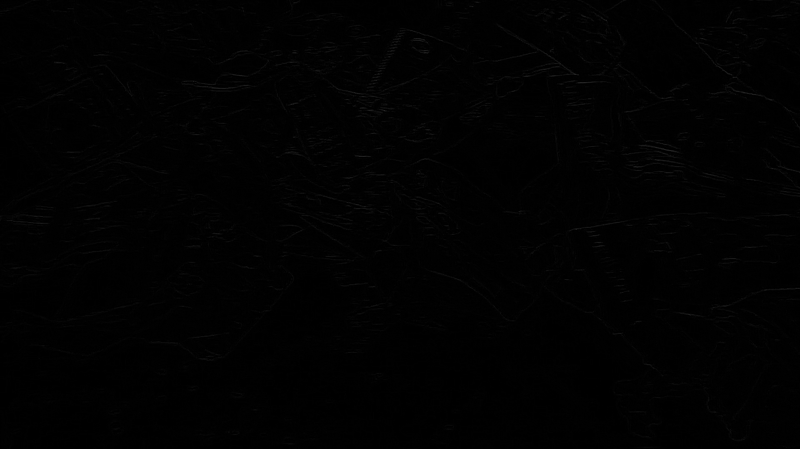
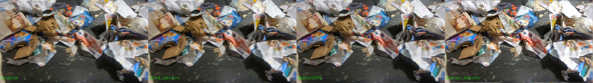

# CS585-final-project: Image Deblurring Applied to Recycling Data
### Team: Diala Lteif, Piotr Teterwak, Kubra Eryilmaz
### Presentation Slides [here](https://docs.google.com/presentation/d/1ktci8VXemanA0XGe1cVYAemxsiuS7Nay7Xf1Ar5M2rU/edit?usp=sharing)
We run and compare available non-DL and DL methods for image deblurring on a video of recycling garbage on a conveyer belt.


###How To Run

Each method has it's own directory in the Github repo, with associated README with detailed instructions. 

The evaluation metrics are computed in the 'compute_metrics.py' in the 'eval' directory. 

## Non-DL Methods
### 1. Blind Deconvolution Using a Normalized Sparsity Measure: [Paper [5]](https://dilipkay.files.wordpress.com/2019/04/priors_cvpr11.pdf) [Code](https://www.dropbox.com/s/wy0yr9zfix3o9xi/norm_sparsity_code.zip?dl=0)
This work uses a regularization function which is the ratio of the <i>l1</i> norm to the <i>l2</i> norm on the high frequencies of an image.
This ratio is inversely proportional to blur in the image, so the stronger the blur, the lower the ratio is. On the other hand, added noise increases the ratio. The <i>l1/l2</i> function is considered a sparsity measure, and it is a normalized version of <i>l1</i>, making it scale invariant. <br/>
The overall algorithm of this method is described below:
<div style="width:800px; margin:0 auto;">

</div>
<br/>

#### Result
To the left is the original data and to the right is the deblurred.


### 2. Wiener Deconvolution: [Definition [8]](https://en.wikipedia.org/wiki/Wiener_deconvolution) [Code [9]](https://github.com/michal2229/dft-wiener-deconvolution-with-psf/blob/master/deconv_cv.py)
The Wiener filter is the MSE-optimal stationary linear filter for images degraded by additive noise and blurring. Calculation of the Wiener filter requires the assumption that the signal and noise processes are second-order stationary (in the random process sense).[7] 

Wiener filters are usually applied in the frequency domain. Given a degraded image g(x,y), one takes the Discrete Fourier Transform (DFT) to obtain G(u,v). The original image spectrum is estimated by taking the product of G(u,v) with the Wiener filter W(u,v):


The inverse DFT is then used to obtain the image estimate from its spectrum. The Wiener filter is defined in terms of these spectra:

```math
H(u,v): Fourier Transform of the Point Spread Function(PSF)
P_s(u,v): Power specturum of the signal process, obtained by taking the Fourier Transform of the signal autocorrection
P_n(u,v): Power specturum of the noise process, obtained by taking the Fourier Transform of the noise autocorrection
```
The Wiener Filter is:


```math
K(u,v) = P_n(u,v)/P_s(u,v)
```

#### Result
To the left is the original data and to the right is the deblurred.


## DL Methods
### 1. DeblurGANv2: [Paper [1]](https://arxiv.org/abs/1908.03826) [Code](https://github.com/VITA-Group/DeblurGANv2)

This work uses an pix2pix[2] style Generative Adverserial Network. They take a pre-trained network, and apply a Feature Pyramid Network [3] on top of it, as shown below. They use  perceptual,adverserial, and mean-squared error losses to train on the Go-Pro dataset[10], where they have high-resolution/blurry pairs. Additionally, they use local and global discriminators. We take such a pretrained network and apply it to the recycling data, using the code provided by the authors linked above.  


#### Result
To the left is the original data and to the right is the deblurred.We note that GIF's introduce their own artifacts. 


If you'd like to view an mp4 of the results, click [here](https://github.com/dlteif/CS585-final-project/blob/master/deblur_gan/results/recycle_deblur.mp4?raw=true). 


## Evaluation

We do both a qualitative and quantitative evaluation of the methods. 

### Quantitative Evaluation

We use a simple method to evaluate the sharpness of the resulting image; we simply compute the variance of the Laplacian of the image [4,6]. The laplacian of an image is given below, for image intensity I:


As you can see, it's simply the sum of image second derivatives in the horizontal and vertical dirctions. In areas where the image is uniform, the second derivatives of the image are 0. However, where the image has edges, the second derivatives of the image are changing very quickly. Therefore, near edges the Laplacian will have non-zero values. Therefore, when there are sharper edges, the variance of the Laplacian will be larger than with an image which has blurry outputs. 

We show laplacians of two sample images below. **We recommend clicking to look at images closely**.

First, we show the laplacian of the blurry input.



Next, we show the laplacian of the deblurred output.


It's clear that edges are sharper in the deblurred output, though both are fairly subtle and you need to look closely.

Finally, for each input, output pair, we compute the difference of the variance of the Laplacian between blurry and deblurred images. See the pseudocode below for a sample of how it's done:

``` 
compute_laplacian(output).variance() - compute_laplacian(input).variance().
```

We do this for 20 input-output pairs, and then take the average. Although we would have liked to run it on more frames, some of our methods are extremely slow. 

We report numbers for all the methods below:

| Model       | Increase in Variance of Laplacian |
| ----------- | ----------- |
| DeblurGANv2      | 7.89       |
| Blind Deconvolution   | 27.16        |
| Wiener Deconvolution w/Motion Blur kernel | **35.38** | 

**According to this metric, Wiener Deconvolution is best followed by Blind Deconvolution and DeblurGANv2. However, this contradicts our qualitative assesment below. We believe that the artifacts introduced by Blind Deconvolution introduce some high frequency noise without actually sharpening the frame.** 

### Qualitative Evaluation

**For all qualitative results we recommend clicking for higher resolution. Also, all GIFS have quantized colors, so we recommend looking at both those and the provided non-GIF figure.**

To further compare the tested methods, we present the outputs of the 3 different methods side by side along with the ground truth over 20 frames sharpness, artifacts. Below is an example figure in which can easily compare the methods.



additionally, we provide before and after GIFs over the sampled frames for each method for better comparison. 
<div align="center">

<br/>
<p><b>Blind Deconvolution using Normalized Sparsity Measure</b></p>
</div>
<br/>
<div align="center">

<br/>
<p><b>DeblurGANv2</b></p>
</div>
<br/>
<div align="center">

<br/>
<p><b>Weiner Deconvolution with Motion Blur Kernel</b></p>
</div>
<br/>
<br/>

To better distinguish the methods, we take a closer look at the artifacts produced by each. 
<div align="center">

<br/>
<p><b>Blind Deconvolution Artifacts: Smooth Checkerboard</b></p>
</div>
<br/>
<div align="center">

<br/>
<p><b>Weiner Deconvolution Artifacts: Ringing</b></p>
</div>
<br/>
<div align="center">

<br/>
<p><b>DeblurGANv2 Artifacts: Hallucinations</b></p>
</div>
<br/>

The ringing in Wiener Deconvolution is because some frequencies are suppressed by the filtering operation, resulting in the effect described [here](http://mriquestions.com/gibbs-artifact.html).

Furthermore, we evaluate the Wiener Deconvolution algorithm with varying hyperparameters and display the results below.


**Perceptually, it appears that Wiener Deconvolution with appropriate and carefully tuned hyperparameters gives the sharpest results, though with some artifacts. DeblurGANv2 is much worse, but with fewer artifacts (though it does add some color in innapropriate places), while Blind Deconvolution is worst.**

## Conclusions

We run and compare 3 methods for deblurring images applied to recycling data. Some of the challenges we faced with the Wiener Deconvolution method are that it is very sensitive to the hyperparameters used such as the Signal to Noise Ratio (SNR) and Point Spread Function (PSF). The limitations of Blind Deconvolution with Normalized Spasity Measure are its high computational inefficiency as it needs to compute the kernel for each frame in a multiscale way, and the regularizer used is highly non-convex. DeblurGAN on the other hand is limited by the generalization ability of the deep learning model it is applied to.   

## Future Directions

All the current methods are frame-wise, and don't leverage the fact that lots of information is in adjacent frames of a video. If we had more time, it'd be interesting to try and leverage adjacent frames through estimated optical flow, for instance. 

### References
[1] Kupyn, Orest, et al. "Deblurgan-v2: Deblurring (orders-of-magnitude) faster and better." Proceedings of the IEEE/CVF International Conference on Computer Vision. 2019.

[2] Isola, Phillip, et al. "Image-to-image translation with conditional adversarial networks." Proceedings of the IEEE conference on computer vision and pattern recognition. 2017.

[3] Lin, Tsung-Yi, et al. "Feature pyramid networks for object detection." Proceedings of the IEEE conference on computer vision and pattern recognition. 2017.

[4] https://www.pyimagesearch.com/2015/09/07/blur-detection-with-opencv/

[5] D. Krishnan, T. Tay and R. Fergus, "Blind deconvolution using a normalized sparsity measure," CVPR 2011, 2011, pp. 233-240, doi: 10.1109/CVPR.2011.5995521. 

[6] Pech-Pacheco, José Luis, et al. "Diatom autofocusing in brightfield microscopy: a comparative study." Proceedings 15th International Conference on Pattern Recognition. ICPR-2000. Vol. 3. IEEE, 2000. 

[7] https://homepages.inf.ed.ac.uk/rbf/CVonline/LOCAL_COPIES/VELDHUIZEN/node15.html

[8] https://en.wikipedia.org/wiki/Wiener_deconvolution

[9] https://github.com/michal2229/dft-wiener-deconvolution-with-psf/blob/master/deconv_cv.py

[10] Nah, Seungjun, Tae Hyun Kim, and Kyoung Mu Lee. "Deep multi-scale convolutional neural network for dynamic scene deblurring." Proceedings of the IEEE conference on computer vision and pattern recognition. 2017.
